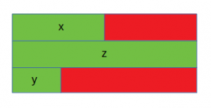

# C++ Structs
---

In C++, classes and structs are blueprints that are used to create the instance of a class. Structs are used for lightweight objects such as Rectangle, Color, Point, etc.

Unlike class, structs in C++ are value type more than reference type. It is useful if you have data that is not intended to be modified after creation of struct.

C++ Structure is a collection of different data types. It is similar to the class that holds different types of data.


## The Syntax Of Structure
---
```
struct structure_name  
{  
     // member declarations.  
}  
```

In the above declaration, a structure is declared by preceding the struct keyword followed by the identifier (structure name). Inside the curly braces, we can declare the member variables of different types. Consider the following situation:

```
struct Student  
{  
    char name[20];  
    int fn;  
    int age;  
}  
```
or
```
struct Student  
{  
    char* name;  
    int fn;  
    int age;  
}  
```


In the above case, Student is a structure contains three variables name, fn, and age. When the structure is declared, no memory is allocated. When the variable of a structure is created, then the memory is allocated.

## How to create the instance of Structure?
---
Structure variable can be defined as:
```
Student s;
```
Here, s is a structure variable of type Student. When the structure variable is created, the memory will be allocated. 


## Is sizeof for a struct equal to the sum of sizeof of each member?
---
The sizeof for a struct is not always equal to the sum of sizeof of each individual member. This is because of the padding added by the compiler to avoid alignment issues. Padding is only added when a structure member is followed by a member with a larger size or at the end of the structure.

Different compilers might have different alignment constraints as C standards state that alignment of structure totally depends on the implementation.

Let’s take a look at the following examples for better understanding:

* Case 1
```
#include <stdio.h> 

int main() 
{ 

	struct A { 

		// sizeof(int) = 4 
		int x; 
		// Padding of 4 bytes 

		// sizeof(double) = 8 
		double z; 

		// sizeof(short int) = 2 
		short int y; 
		// Padding of 6 bytes 
	}; 

	printf("Size of struct: %ld", sizeof(struct A)); 

	return 0; 
} 
```

*Output:*
```
Size of struct: 24
```


*The red portion represents the padding added for data alignment and the green portion represents the struct members. In this case, x (int) is followed by z (double), which is larger in size as compared to x. Hence padding is added after x. Also, padding is needed at the end for data alignment.*

* Case 2:
```
#include <stdio.h> 
  
int main() 
{ 
  
    struct B { 
        // sizeof(double) = 8 
        double z; 
  
        // sizeof(int) = 4 
        int x; 
  
        // sizeof(short int) = 2 
        short int y; 
        // Padding of 2 bytes 
    }; 
  
    printf("Size of struct: %ld", sizeof(struct B)); 
  
    return 0; 
} 
```
*Output:*
```
Size of struct: 16
```


*In this case, the members of the structure are sorted in decreasing order of their sizes. Hence padding is required only at the end.*

* Case 3:
```
#include <stdio.h> 
  
int main() 
{ 
  
    struct C { 
        // sizeof(double) = 8 
        double z; 
  
        // sizeof(short int) = 2 
        short int y; 
        // Padding of 2 bytes 
  
        // sizeof(int) = 4 
        int x; 
    }; 
  
    printf("Size of struct: %ld", sizeof(struct C)); 
  
    return 0; 
} 
```
*Output:*
```
Size of struct: 16
```


*In this case, y (short int) is followed by x (int) and hence padding is required after y. No padding is needed at the end in this case for data alignment.*

## How to access the variable of Structure:
---
The variable of the structure can be accessed by simply using the instance of the structure followed by the dot (.) operator and then the field of the structure.

*For example:*
```
s.id = 4;  
```
*In the above statement, we are accessing the id field of the structure Student by using the dot(.) operator and assigns the value 4 to the id field.*

## How to initialize structure members?
---
Structure members cannot be initialized with declaration. For example the following C++ program fails in compilation with C++ versions before C++11.
**But is considered correct in C++11 and above.**
```
struct Point 
{ 
   int x = 0;  // COMPILER ERROR:  cannot initialize members here 
   int y = 0;  // COMPILER ERROR:  cannot initialize members here 
}; 
``` 
The reason for above error is simple, when a datatype is declared, no memory is allocated for it. Memory is allocated only when variables are created.

Structure members can be initialized using curly braces ‘{}’. For example, following is a valid initialization.
```
struct Point 
{ 
   int x, y; 
};  
  
int main() 
{ 
   // A valid initialization. member x gets value 0 and y 
   // gets value 1.  The order of declaration is followed. 
   struct Point p1 = {0, 1};  
}
```

## What is an array of structures?
---
Like other primitive data types, we can create an array of structures.
```
#include <iostream> 
using namespace std; 
  
struct Point { 
    int x, y; 
}; 
  
int main() 
{ 
    // Create an array of structures 
    struct Point arr[10]; 
  
    // Access array members 
    arr[0].x = 10; 
    arr[0].y = 20; 
  
    cout << arr[0].x << " " << arr[0].y; 
    return 0; 
} 
```
*Output:*
```
10 20
```
## What is a structure pointer?
---
Like primitive types, we can have pointer to a structure. If we have a pointer to structure, members are accessed using arrow ( -> ) operator instead of the dot (.) operator.

```
#include <iostream> 
using namespace std; 
  
struct Point { 
    int x, y; 
}; 
  
int main() 
{ 
    struct Point p1 = { 1, 2 }; 
  
    // p2 is a pointer to structure p1 
    struct Point* p2 = &p1; 
  
    // Accessing structure members using 
    // structure pointer 
    cout << p2->x << " " << p2->y; 
    return 0; 
}
```
*Output:*
```
1 2
```

## Pointer in a structure
---
```
#include <iostream> 
using namespace std; 
  
struct A { 
    int x;
    A a; // That way the compiler can not evaluate the size of the structure
}; 
```
```
#include <iostream> 
using namespace std; 
  
struct A { 
    int x;
    A *a; // Ok
}; 
```


### Side note: the typedef specifier
[link](https://en.cppreference.com/w/cpp/language/typedef)