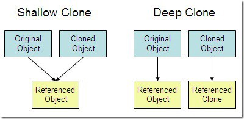

# The Rule of The Big Four (and a half)
#### Constructor, Destructor, Copy Constructor, Assignment Operator

## Constructor

A constructor is a member function of a class which initializes the objects (instances) of the class. In C++, the Constructor is automatically called when an object is created. 

>Note: The constructor has the same name as the class, it is always public, and it does not have any return value.

*If we do not specify a constructor, C++ compiler generates a default constructor for us (expects no parameters and has an empty body).*

### Parameterized Constructor

A default constructor does not have any parameter, but if you need, a constructor can have parameters. This helps you to assign initial value to an object at the time of its creation

### Using Initialization Lists to Initialize Fields

In case of a parameterized constructor, you can use the following syntax to initialize the fields:
```
Line::Line( double len): length(len) {
   cout << "Object is being created, length = " << len << endl;
}
```
This syntax is equal to the following syntax:
```
Line::Line( double len) {
   cout << "Object is being created, length = " << len << endl;
   length = len;
}
```

If for a class *C*, you have multiple fields *X*, *Y*, *Z*, etc., to be initialized, then use can use same syntax and separate the fields by comma as follows:
```
C::C( double a, double b, double c): X(a), Y(b), Z(c) {
   ...
}
```

## Destructor

A destructor is a special member function of a class that is executed whenever an object of it's class goes out of scope or whenever the delete expression is applied to a pointer to the object of that class.

A destructor will have the exact same name as the class prefixed with a tilde (~) and it can neither return a value nor can it take any parameters. Destructors can be very useful for releasing resources before coming out of the program like closing files, releasing dynamically allocated memory etc.

## Copy Constructor

A copy constructor is a member function which initializes an object using another object of the same class. A copy constructor has the following general function prototype:
```
ClassName (const ClassName &old_obj); 
```

### When is copy constructor called?

In C++, a Copy Constructor may be called in following cases:

* When an object of the class is returned by value.
```
// example function that returns an
// object of class ClassName by value
ClassName functionName(){
    ClassName objectName;
    ...
    return objectName;
}
```

* When an object of the class is passed (to a function) by value as an argument.
```
// example of passing an object of 
// class ClassName to function by value
returnType functionName(ClassName objectName){
    ...
}
...
int main(){

    ClassName object;
    ...
    functionName(object); // this uses the copy constructor 
                          // to create a copy of the object
    ...

    return 0;
}
```

* When an object is constructed based on another object of the same class.

```
ClassName object1;
ClassName object2(object1);
// or
ClassName object3 = object2;
```

* When the compiler generates a temporary object.

>It is, however, not guaranteed that a copy constructor will be called in all these cases, because the C++ Standard allows the compiler to optimize the copy away in certain cases, one example is the return value optimization (sometimes referred to as [RVO](https://en.wikipedia.org/wiki/Copy_elision#Return_value_optimization)).

### When is user-defined copy constructor needed?

If we don’t define our own copy constructor, the C++ compiler creates a default copy constructor for each class which does a member-wise copy between objects. The compiler created copy constructor works fine in general. We need to define our own copy constructor only if an object has pointers or any runtime allocation of the resource like file handle, a network connection, etc.

**The default copy constructor creates a shallow copy. Deep copy is possible only with user defined copy constructor.**

In user defined copy constructor, we make sure that pointers (or references) of copied object point to new memory locations.



### Can we make the copy constructor private?

A copy constructor **can** be made private. When we make a copy constructor private in a class, objects of that class become non-copyable. This is particularly useful when our class has pointers or dynamically allocated resources. In such situations, we can either write our own copy constructor like above String example or make a private copy constructor so that users get compiler errors rather than surprises at runtime.

### Why the argument to a copy constructor must be passed by reference?

A copy constructor is called when an object is passed by value. Copy constructor itself is a function. So if we pass an argument by value in a copy constructor, a call to copy constructor would be made to call copy constructor which becomes a non-terminating chain of calls. Therefore the compiler doesn’t allow parameters to be passed by value.

### Why argument to a copy constructor should be const?

One reason for passing const reference is, we should use const in C++ wherever possible so that objects are not accidentally modified. This is one good reason for passing reference as const, but there is more to it. For example, predict the output of following C++ program. Assume that copy elision is not done by compiler.
```
#include<iostream> 
using namespace std; 
  
class Test 
{ 
   /* Class data members */ 
public: 
   Test(Test &t) { /* Copy data members from t*/} 
   Test()        { /* Initialize data members */ } 
}; 
  
Test fun() 
{ 
    cout << "fun() Called\n"; 
    Test t; 
    return t; 
} 
  
int main() 
{ 
    Test t1; 
    Test t2 = fun(); 
    return 0; 
} 
```
*Output:*
```
Compiler Error in line "Test t2 = fun();" 
```

The program looks fine at first look, but it has compiler error. If we add const in copy constructor, the program works fine, i.e., we change copy constructor to the following.
```
Test(const Test &t) { cout << "Copy Constructor Called\n"; } 
```
Or if we change the line “Test t2 = fun();” to following two lines, then also the program works fine.
```
Test t2;  
t2 = fun(); 
```

The function fun() returns objects by value. So the compiler creates a temporary object which is copied to t2 using the copy constructor in the original program (The temporary object is passed as an argument to the copy constructor). The reason for the compiler error is, compiler created temporary objects cannot be bound to non-const references and the original program tries to do that. It doesn’t make sense to modify compiler created temporary objects as they can die at any moment.

## Assignment Operator

* Copy constructor vs Assignment Operator

Which of the following two statements call copy constructor and which one calls assignment operator?
```
MyClass t1, t2; 
MyClass t3 = t1;  // ----> (1) 
t2 = t1;          // -----> (2)  
```
Copy constructor is called when a new object is created from an existing object, as a copy of the existing object. Assignment operator is called when an already initialized object is assigned a new value from another existing object. In the above example (1) calls copy constructor and (2) calls assignment operator. 

## Advice

* Give a class a default constructor if and only if there is a "natural" default value
* If a constructor acquires a resource, its class needs a destructor to release the resource 
* Consider the Rule of Zero: The Rule of Zero states that you do not provide any of the functions that the compiler can provide (copy constructor, copy assignment operator, move constructor, move assignment operator, destructor) unless the class you are constructing does some novel form of ownership.

