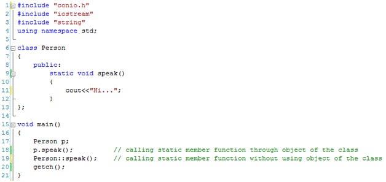
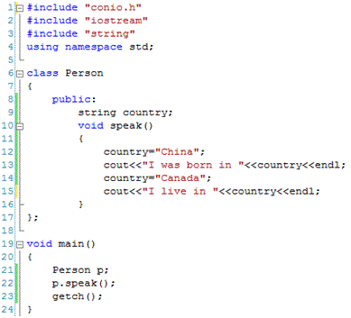
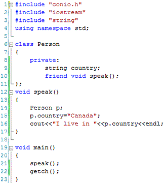

# Types of Member Functions in C++:  Simple, Static, Const, Inline and Friend Member Functions

C++ is very rich in member functions as compared to some other languages offering object oriented programming.  Other computer languages offer one or two types of member functions while C++ offers the following types of member functions:

* [**Simple member functions**](##Simple-Member-Functions)
* [**Static member functions**](##Static-Member-Functions)
* [**Const member functions**](##Const-Member-Functions)
* [**Inline member functions**](##Inline-Member-Functions)
* [**Friend member functions**](##Friend-Member-Functions)

## Simple Member Functions
If we define a member function in a class without specifying any particular type (as to be discussed below) then it is called simple member functions. As it doesn’t have any additional requirements therefore it is called simple (sometimes called basic) member function of a class. A simple member function follows the following syntax.
```
data_type function_name(parameters)
{
statement(s);
…
}
```

## Static Member Functions

Static members of a class play an important role in object oriented programming. Although it is a bit earlier to discuss the affect of static keyword in OOP but we should know that if a member function of a class is declared as static then it means that the member function declared as static can be accessed directly in main function or can be accessed through the objects of the class as mentioned in the following code.



The static member function is defined at line 9 and called at lines 18 and 19. At line 18, the static member function is called through the object of the class (p.speak()) using dot(.) operator, while at line 19 the static member function is called through scope resolution operator (::) without using the object of the class (Person::speak()).

It is important to note that static member functions can use only static variables in it. Static variables are also called class variables having same memory to be shared among all the objects of the class. Static variables will be discussed in detail in another tutorial.

## Const Member Functions

Sometimes it is required that a member function should not be allowed to change the values of data members. In this case we define const member functions. As the name suggests, the data members are treated as const (short for constant) in this kind of member function. Once defined it will not allow us to change the value of any data member within its body. To understand const member function, consider the following code.



We can see in line 12 and line 14 that the value of data member ‘country’ is changed by the member function ‘speak’. If we wish that member function should not be allowed to change the value of any data member within its body then we need to add ‘const’ keyword as shown below.
```
class Person
{
public:
    std::string country;
    void speak() const
    {
    //It will use all the data members as constants
    //Values of data members cannot be changed here
    }
};
```

## Inline Member Functions

These member functions are of special considerations and are used to increase the speed of processing if used sensibly otherwise they can behave vice versa. They are short functions defined within the body of the class. if defined outside the class boundary then they must be prefixed by ‘inline’ keyword. Inline member functions will be discussed in detail in the following tutorial.

## Friend Functions

This is an important kind of member function used in C++. As discussed in an earlier tutorial that a data member declared as private cannot be accessed outside the class where declared but a friend function is an exception. Although friend function is not member function of a class but can access all the data members of the class including private data members as shown in the example below.



We can see that the data member ‘country’ is declared as ‘private’ in class ‘Person’ but is accessed in the friend function ‘speak’ at line 15. If we remove the code at line 10 then the same code will cause syntax error as the private variable ‘country’ will not be accessed in the function ‘speak’ any more.

[**Source**](http://www.certiology.com/tutorials/c-plus-plus-tutorial/types-of-member-functions-in-c-plus-plus.html)
